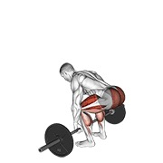
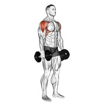

<div align="center">

# Exercises Dataset + Workout Planner

<p>
  
  
  
  
  
  
</p>

**A comprehensive, ready-to-use fitness exercise dataset with 1,324 exercises — each with animation GIFs, thumbnail images, muscle group info, equipment data, and full bilingual instructions. Now includes a full weekly workout planner.**

[](data/exercises.json)
[](videos/)
[](images/)
[](#license)

</div>

---

## Disclaimer

> This repository is provided for **educational and non-commercial research purposes only**.
> All exercise media (images, videos) belong to their respective copyright holders.
> **Commercial use is strictly prohibited.**
> If you are a copyright owner and wish to have your content removed, please [open an issue](../../issues) or contact the repository owner.

---

## Table of Contents

- [Overview](#overview)
- [What's New](#whats-new)
- [Interactive Tools](#interactive-tools)
- [File Structure](#file-structure)
- [Statistics](#statistics)
- [Data Schema](#data-schema)
- [Sample Exercises](#sample-exercises)
- [Usage Examples](#usage-examples)
- [License](#license)

---

## Overview

This dataset is a curated collection of **1,324 fitness exercises** sourced for educational and research purposes. It covers a wide range of muscle groups, equipment types, and exercise categories, making it ideal for:

- Building fitness or workout planning applications
- Machine learning projects involving exercise recognition or recommendation
- Health and wellness research
- Educational demonstrations and prototypes

Each exercise entry contains:

| Field | Description |
|---|---|
| Unique ID | Numeric identifier (e.g. `"0001"`) |
| Name | Full descriptive exercise name |
| Category | Primary muscle group targeted |
| Target | Specific target muscle |
| Muscle Group | Supporting / synergist muscles |
| Equipment | Equipment required (or `body weight` for bodyweight) |
| Instructions (EN) | Step-by-step instructions in English |
| Instructions (TR) | Step-by-step instructions in Turkish |
| Thumbnail | Static `.jpg` preview image |
| Animation GIF | `.gif` animation showing the movement |

---

## What's New

The original dataset browser has been extended with a complete workout planning system. All three HTML pages share a unified dark/light theme and are fully self-contained — no server, no install, no dependencies.

### Workout Planner (`workout-planner.html`)

A new page for building and storing a weekly training routine.

- Select any day of the week (Monday through Sunday) from a strip at the top.
- Set default sets, reps, and inter-set rest time per day. These defaults are pre-filled when adding exercises.
- Add exercises from a searchable, filterable sidebar showing all 1,324 exercises. Exercises can also be added directly from the detail modal in the main browser.
- Each added exercise appears as a card with individual sets and reps fields that can be overridden independently of the day defaults.
- Cards can be reordered by drag-and-drop.
- A summary bar at the bottom shows total exercises, total sets, total reps, and estimated rest time for the active day.
- An overview tab shows all seven days side-by-side with their exercise lists and rest settings.
- The entire routine is saved in the browser's `localStorage` under the key `workout_v3` and persists between sessions.

### Add to Routine from the Exercise Browser (`index.html`)

The exercise detail modal now includes a built-in "Add to routine" widget between the muscle info and the instructions.

- A day picker shows all seven days with a live badge on each button indicating how many exercises are already scheduled for that day.
- Sets and reps fields are pre-filled with the defaults configured for the selected day.
- Clicking the add button saves the exercise to that day's routine and immediately shows two confirmations: an inline green banner inside the modal with a direct link to the planner, and a toast notification in the bottom-right corner also linking to the planner.
- If the exercise is already in that day's routine, clicking add again updates the sets and reps instead of creating a duplicate.
- The orange "Workout Planner" button in the top bar carries a live badge showing the total number of exercises saved across the entire week, updating in real time as exercises are added.

### Navigation

A persistent top bar is now fixed above the exercise grid on `index.html`, always visible regardless of scroll position. It contains the "Workout Planner" button prominently in the header, with the live exercise count badge described above. Previously this link was hidden inside the smaller sidebar header.

The workout planner page includes a back link to the exercise browser in its navigation bar.

### Dark and Light Theme

All three pages (`index.html`, `workout-planner.html`, `setup.html`) now support a dark/light theme toggle via a sun/moon icon button in the page header.

- The default theme is dark.
- The user's preference is saved in `localStorage` under the key `exercisedb_theme` and is applied immediately on page load, before any CSS renders, to prevent a flash of the wrong theme.
- The preference persists when navigating between all three pages, so switching to light mode on the browser also carries over to the planner and the setup guide.

---

## Interactive Tools

All three tools are standalone HTML files. Extract the ZIP, open any file directly in a modern browser, and everything works from the filesystem without a server.

### `index.html` — Exercise Browser

- Live search across all 1,324 exercises
- Filter by category, equipment, and target muscle
- Infinite scroll grid with thumbnail previews
- Click any card to open a detail modal with the full GIF, muscle info, bilingual instructions, and the add-to-routine widget
- Top bar with prominent Workout Planner link and live count badge
- Dark/light theme toggle

### `workout-planner.html` — Weekly Workout Planner

- Seven-day routine builder with per-day settings (sets, reps, rest time)
- Searchable and filterable exercise library in the sidebar
- Per-exercise sets and reps override
- Drag-and-drop reordering
- Day-level summary stats and full weekly overview tab
- Routine saved locally and shared with the exercise browser
- Dark/light theme toggle

### `setup.html` — Developer Setup Guide

- Step-by-step guide for integrating the dataset into a backend
- Generate ready-to-run SQL `INSERT` scripts for SQL Server, PostgreSQL, MySQL, and SQLite
- Copy-paste API client code in JavaScript, Python, C#, Java, PHP, Go, and cURL
- LLM prompt generator for producing a complete REST API in one shot
- Dark/light theme toggle

---

## File Structure

```
exercises-dataset/
├── data/
│   ├── exercises.json        # Full dataset — 1,324 exercise records (JSON array)
│   └── exercises_min.json    # Compact version used by the workout planner (inline data)
├── images/                   # Exercise thumbnail images (.jpg) — 1,324 files
├── videos/                   # Exercise animation GIFs (.gif) — 1,324 files
├── index.html                # Exercise browser with dark/light theme and add-to-routine
├── workout-planner.html      # Weekly workout planner (self-contained, all data inline)
├── setup.html                # Developer setup guide
└── README.md
```

### Key Files

- **`data/exercises.json`** — The primary data file. A JSON array of 1,324 exercise objects with all metadata and relative paths to media files.
- **`data/exercises_min.json`** — A compact subset of the dataset (id, name, category, equipment, target) used by the workout planner. The planner loads this file at runtime — both files must remain in the same relative directory.
- **`images/`** — 1,324 thumbnail JPGs named with the exercise ID (e.g. `0001-2gPfomN.jpg`).
- **`videos/`** — 1,324 GIF animations demonstrating each movement (e.g. `0001-2gPfomN.gif`).
- **`index.html`** — Main exercise browser. Open directly in any modern browser.
- **`workout-planner.html`** — Standalone workout planner. Exercise data is embedded directly in the file, so it works without needing the `data/` folder.
- **`setup.html`** — Developer integration guide.

> The `images/` and `videos/` folders must remain alongside `index.html` and `setup.html` for media to load correctly when opening from the filesystem.

---

## Statistics

| Metric | Count |
|---|---|
| Total Exercises | **1,324** |
| Animation GIFs | **1,324** |
| Thumbnail Images | **1,324** |

### Exercises by Body Part

| Body Part | Exercise Count |
|---|---|
| Upper Arms | 292 |
| Upper Legs | 227 |
| Back | 203 |
| Waist | 169 |
| Chest | 163 |
| Shoulders | 143 |
| Lower Legs | 59 |
| Lower Arms | 37 |
| Cardio | 29 |
| Neck | 2 |

### Exercises by Equipment

| Equipment | Exercise Count |
|---|---|
| Body Weight | 325 |
| Dumbbell | 294 |
| Cable | 157 |
| Barbell | 154 |
| Leverage Machine | 81 |
| Band | 54 |
| Smith Machine | 48 |
| Kettlebell | 41 |
| Weighted | 36 |
| Stability Ball | 28 |
| EZ Barbell | 23 |
| Other | 83 |

> Roughly 25% of exercises require no equipment, making this dataset well-suited for at-home workout applications.

---

## Data Schema

Each record in `data/exercises.json` follows this structure:

| Field | Type | Description |
|---|---|---|
| `id` | `string` | Unique numeric identifier (e.g. `"0001"`) |
| `name` | `string` | Full exercise name (e.g. `"3/4 Sit-up"`) |
| `category` | `string` | Body part category (e.g. `"upper arms"`, `"chest"`, `"back"`) |
| `body_part` | `string` | Same as `category` |
| `equipment` | `string` | Required equipment (e.g. `"dumbbell"`, `"body weight"`) |
| `instructions.en` | `string` | Full step-by-step instructions in English |
| `instructions.tr` | `string` | Full step-by-step instructions in Turkish |
| `muscle_group` | `string` | Primary synergist muscle group |
| `secondary_muscles` | `array[string]` | Additional muscles involved |
| `target` | `string` | Primary target muscle (e.g. `"biceps"`, `"pectorals"`) |
| `image` | `string` | Relative path to thumbnail (e.g. `"images/0001-2gPfomN.jpg"`) |
| `gif_url` | `string` | Relative path to animation GIF (e.g. `"videos/0001-2gPfomN.gif"`) |
| `created_at` | `string` | ISO 8601 timestamp of record creation |

### Sample Record

```json
{
  "id": "0001",
  "name": "3/4 sit-up",
  "category": "waist",
  "body_part": "waist",
  "equipment": "body weight",
  "instructions": {
    "en": "Lie flat on your back with your knees bent and feet flat on the ground. Place your hands behind your head with your elbows pointing outwards. Engaging your abs, slowly lift your upper body off the ground, curling forward until your torso is at a 45-degree angle. Pause for a moment at the top, then slowly lower your upper body back down to the starting position. Repeat for the desired number of repetitions.",
    "tr": "Sırt üstü yatın, dizlerinizi bükün ve ayaklarınızı yere düz koyun. Ellerinizi başınızın arkasına, dirsekleriniz dışa bakacak şekilde yerleştirin. Karın kaslarınızı kasarak üst vücudunuzu yerden kaldırın ve gövdeniz 45 derecelik açıya gelene kadar öne doğru kıvırın. Bir an için bu pozisyonda bekleyin, ardından yavaşça başlangıç konumuna geri dönün. İstenen tekrar sayısı için hareketi tekrarlayın."
  },
  "muscle_group": "hip flexors",
  "secondary_muscles": ["hip flexors", "lower back"],
  "target": "abs",
  "image": "images/0001-2gPfomN.jpg",
  "gif_url": "videos/0001-2gPfomN.gif",
  "created_at": "2026-03-18 12:31:32.854798+00:00"
}
```

---

## Sample Exercises

---

### 1 — Barbell Bench Press — Chest


> **Animation:** `videos/0025-EIeI8Vf.gif`
> **Equipment:** Barbell — **Target:** Pectorals — **Secondary:** Triceps, Shoulders

The Barbell Bench Press is the cornerstone of chest training and one of the "Big Three" powerlifting movements. Lying flat on a bench, you lower a loaded barbell to your chest and press it back up. It simultaneously recruits the pectorals, triceps, and anterior deltoids, making it the single most effective exercise for upper body pushing strength and chest mass.

**Key cues:** Retract and depress your scapulae before unracking. Keep feet flat on the floor, maintain a natural lower back arch, and use a shoulder-width grip. Lower the bar under control to mid-chest and drive up through the heels.

---

### 2 — Barbell Deadlift — Upper Legs / Back


> **Animation:** `videos/0032-ila4NZS.gif`
> **Equipment:** Barbell — **Target:** Glutes — **Secondary:** Hamstrings, Lower Back

The Barbell Deadlift is widely regarded as the ultimate full-body strength exercise. It engages virtually every major muscle in the posterior chain while also demanding significant contribution from the upper back, traps, and grip. Proper spinal alignment and bracing are critical for both performance and safety.

**Key cues:** Set up with the bar over mid-foot. Hinge at the hips, grip just outside your legs, brace your core, and keep the bar against your shins throughout. Drive the floor away and lock out at the top by squeezing the glutes.

---

### 3 — Barbell Full Squat — Upper Legs


> **Animation:** `videos/0043-qXTaZnJ.gif`
> **Equipment:** Barbell — **Target:** Glutes — **Secondary:** Quadriceps, Hamstrings, Calves, Core

Often called the king of all exercises, the Barbell Full Squat demands coordinated strength across the entire lower body and core. Breaking parallel maximizes glute and hamstring activation compared to partial squats.

**Key cues:** Bar on upper traps (high bar) or rear deltoids (low bar). Brace your core before descent, push knees out in line with toes, and descend until your thighs pass parallel to the floor. Drive through the whole foot to stand.

---

### 4 — Dumbbell Biceps Curl — Upper Arms


> **Animation:** `videos/0294-NbVPDMW.gif`
> **Equipment:** Dumbbell — **Target:** Biceps — **Secondary:** Forearms

The Dumbbell Biceps Curl is the most recognized isolation exercise for the arms. Training each side independently helps identify and correct strength imbalances between limbs.

**Key cues:** Stand tall with elbows pinned to your sides. Supinate your wrists as you curl, squeeze at the top, and lower under control. Avoid swinging or using momentum from the shoulders.

---

### 5 — Pull-up — Back


> **Animation:** `videos/0652-lBDjFxJ.gif`
> **Equipment:** Body Weight — **Target:** Lats — **Secondary:** Biceps, Forearms

The Pull-up is the gold standard bodyweight exercise for upper body pulling strength. It primarily develops the latissimus dorsi while heavily involving the biceps, rear deltoids, and core stabilizers.

**Key cues:** Dead hang from an overhand grip, shoulder-width or slightly wider. Initiate with your lats by depressing your shoulder blades, then pull your chest toward the bar. Lower fully between reps.

---

### 6 — Dumbbell Lateral Raise — Shoulders


> **Animation:** `videos/0334-DsgkuIt.gif`
> **Equipment:** Dumbbell — **Target:** Delts — **Secondary:** Traps

The Dumbbell Lateral Raise is the go-to isolation exercise for building shoulder width. It directly targets the lateral head of the deltoid, responsible for the broad-shouldered look.

**Key cues:** Slight bend in the elbows throughout. Raise the dumbbells out to the sides until your arms are parallel to the floor. Lead with your elbows, not your wrists. Lower slowly to maximize time under tension.

---

## Usage Examples

### Python — Load and Filter

```python
import json

with open("data/exercises.json", "r", encoding="utf-8") as f:
    exercises = json.load(f)

print(f"Total exercises loaded: {len(exercises)}")

# Filter by category
chest_exercises = [ex for ex in exercises if ex["category"] == "chest"]
print(f"Chest exercises: {len(chest_exercises)}")
# -> Chest exercises: 163

# Filter by equipment
bodyweight = [ex for ex in exercises if ex["equipment"] == "body weight"]
print(f"Bodyweight exercises: {len(bodyweight)}")
# -> Bodyweight exercises: 325

# Get all unique categories
categories = sorted({ex["category"] for ex in exercises})
print("Categories:", categories)

# Access bilingual instructions
ex = exercises[0]
print(ex["instructions"]["en"])  # English
print(ex["instructions"]["tr"])  # Turkish
```

### Python — Load with Pandas

```python
import json
import pandas as pd

with open("data/exercises.json", "r", encoding="utf-8") as f:
    data = json.load(f)

df = pd.DataFrame(data)

# Top categories by exercise count
print(df["category"].value_counts().head(10))

# All barbell exercises targeting upper legs
barbell_quads = df[(df["equipment"] == "barbell") & (df["category"] == "upper legs")]
print(barbell_quads[["name", "target", "equipment"]])
```

### JavaScript / Node.js

```js
const exercises = require("./data/exercises.json");

console.log(`Total exercises: ${exercises.length}`);

// Bodyweight exercises only
const bodyweight = exercises.filter(ex => ex.equipment === "body weight");
console.log(`Bodyweight exercises: ${bodyweight.length}`);
// -> Bodyweight exercises: 325

// Group exercises by category
const byCategory = exercises.reduce((acc, ex) => {
    acc[ex.category] = acc[ex.category] || [];
    acc[ex.category].push(ex);
    return acc;
}, {});

// Access bilingual instructions
const ex = exercises[0];
console.log(ex.instructions.en); // English
console.log(ex.instructions.tr); // Turkish
```

### TypeScript — Type-safe Usage

```typescript
interface Exercise {
    id: string;
    name: string;
    category: string;
    body_part: string;
    equipment: string;
    instructions: {
        en: string;
        tr: string;
    };
    muscle_group: string;
    secondary_muscles: string[];
    target: string;
    image: string;
    gif_url: string;
    created_at: string;
}

import exercises from "./data/exercises.json";
const data = exercises as Exercise[];

const shuffled = data.sort(() => Math.random() - 0.5);
const randomWorkout: Exercise[] = shuffled.slice(0, 6);
console.log("Random 6-exercise workout:", randomWorkout.map(e => e.name));
```

---

## License

This project is for **educational and non-commercial purposes only**.

- You may use this dataset for personal projects, research, and learning.
- You may not use this dataset or its media for any commercial application or product.
- All images and videos are property of their respective copyright holders.
- For commercial use, please contact the original content owners directly.

If you are a copyright holder and wish to have your content removed, please [open an issue](../../issues).